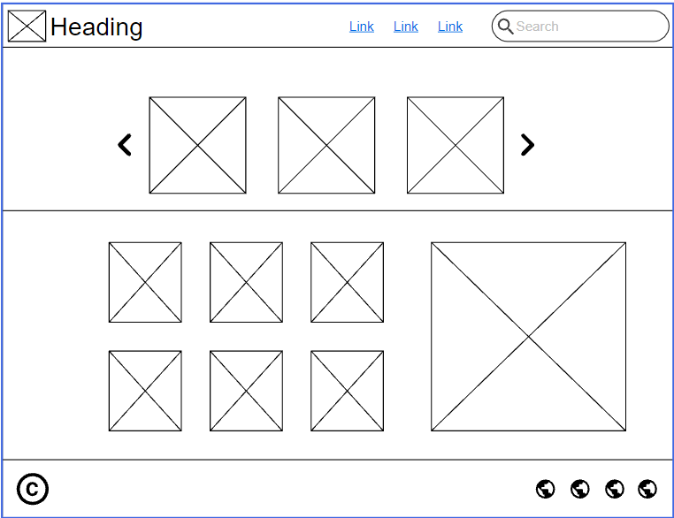
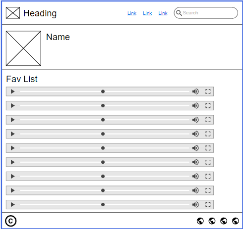
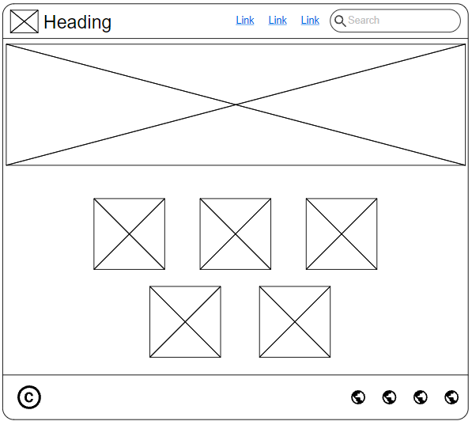

## Wier Frame

### home page

### Fav List

### About us page

## tools that we will use 

1. deploy the frontend on netlify
2. deploy the backend on heroku
3. deploy the mongodb on atlase
4. use git hub to upload our code
5. using git on ubunto to push our work
6. using visual studio code to write our code
